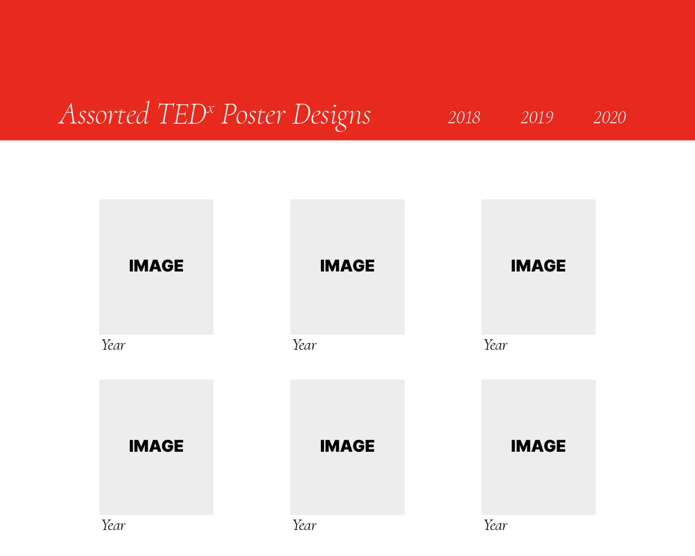
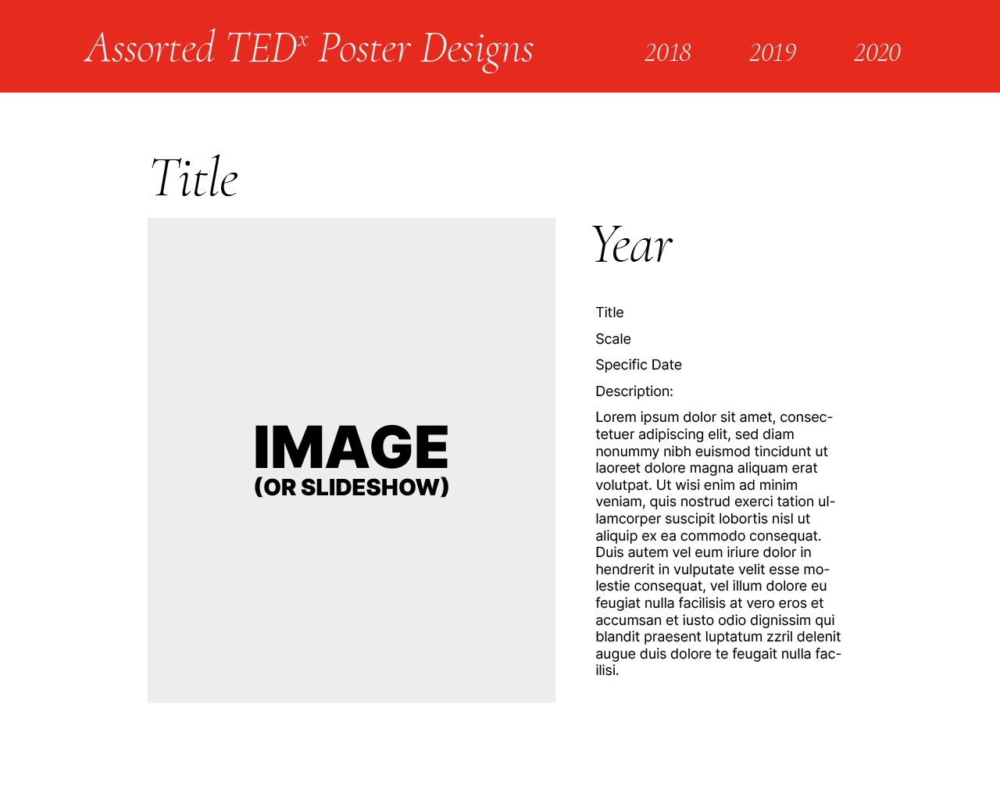

# Project 4a: Visual Design

Matthew Sundberg

msundbe2

## Layout

For the homepage, I intend to use a card layout, to best display an overview look at the various images. Along the top I will have a navbar, with dropdowns for each year.

For the individual design pages, I intend to use a two-column layout with the image(s) taking up 2/3rds of the screen on the left, followed by the metadata in a column on the right.

## Stylistic Choices

### Colors
Each year brings a different color scheme with the design system I created for that year, yet throughout it all the TEDx Branding mandated red is a consistent [Pantone 485][tedx-branding]. I will use this color as the main accent color, paired with a neutral light gray (since full white is harsher on the eyes, despite making for better contrast) and a solid black.

The specific colors I will use are as follows:

* *Accent Red:* #e62b1e
* *Bland White:* #ededed
* *Solid Black:* #000000

### Font Choices
The TEDx brand guideline specified font is [Helvetica Neue Black][tedx-branding], which is an incredibly pricey font. Since that option is off the table (and using a similar font for the headings to match would be distracting due to the differences), I selected a sleek serif font&em;Cormorant&em;that is nearly opposite in features from Helvetica (high stroke contrast, low x-height, heavy stylization and swash incorporation). I intend to use the italic style of the font which is based upon the designs of Garamond, yet independently digitized and improved. Through the contrast the two fonts will nicely offset each other without clashing. For the body text, I selected Inter, a humanistic sans which is nondescript and highly has high legibility. Readability will be increased with a raised line height, in addition to the utilization of the contrasting colors selected in the color palette.

[tedx-branding]: https://www.ted.com/participate/organize-a-local-tedx-event/tedx-organizer-guide/branding-promotions/logo-and-design/your-tedx-logo
